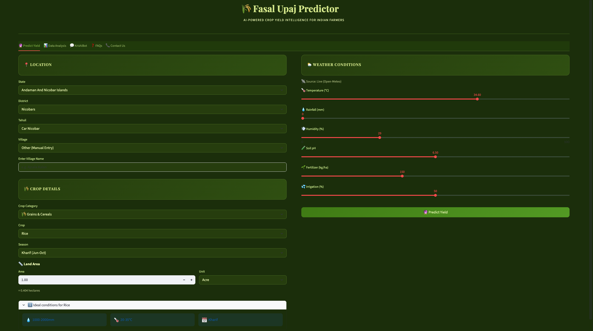
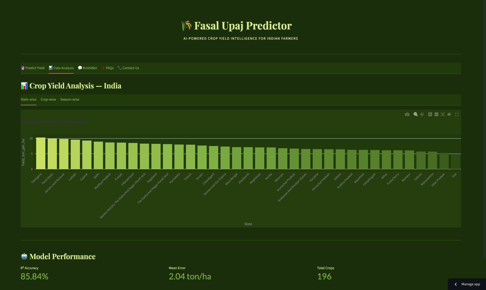
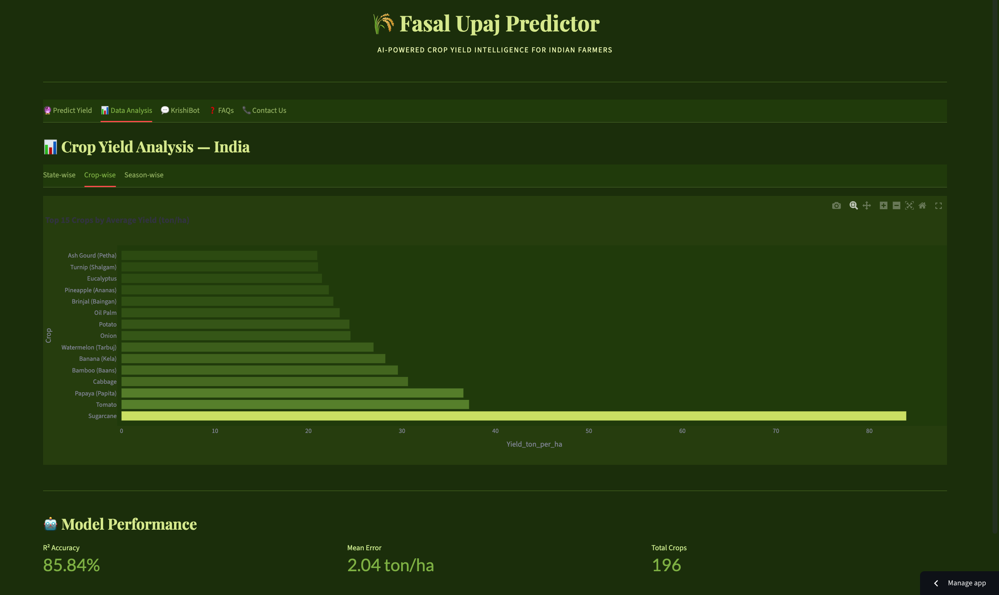
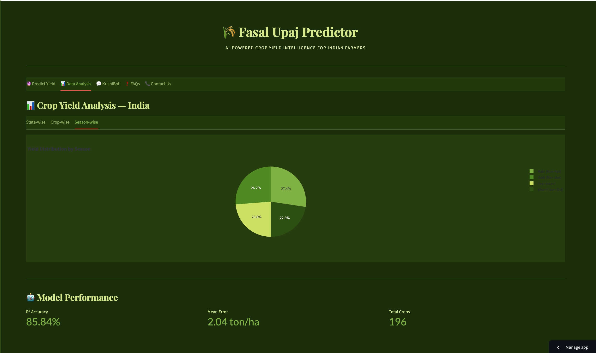
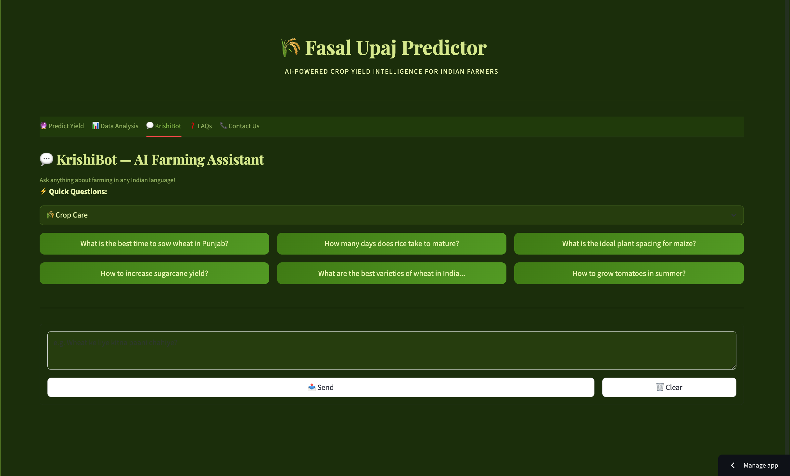
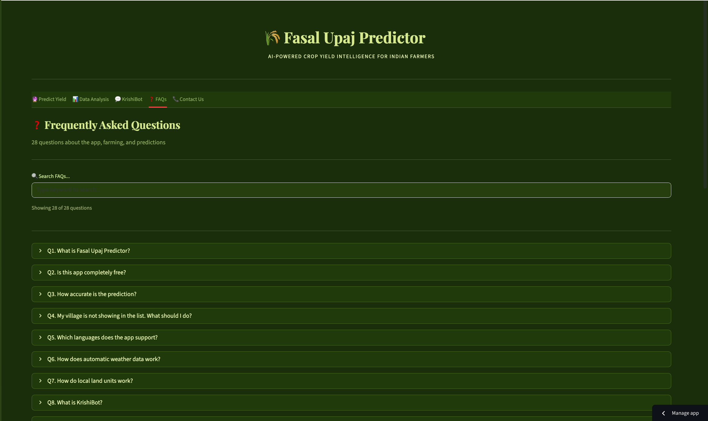
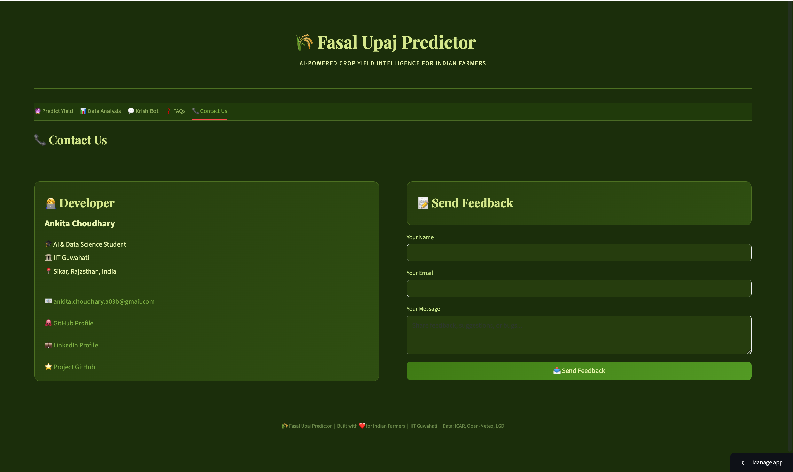

# 🌾 Fasal Upaj Predictor

<div align="center">

### AI-Powered Hyperlocal Crop Yield Predictor for Indian Farmers

[](https://fasal-upaj-predictor.streamlit.app)
[](https://python.org)
[](LICENSE)
[](https://lgdirectory.gov.in)
[](https://icar.org.in)

**Developer:** Ankita Choudhary | AI & Data Science — IIT Guwahati

[🚀 Live Demo](https://fasal-upaj-predictor.streamlit.app) • [🐛 Report Bug](https://github.com/ankitarchoudhary/Crop-Yield-Predictor/issues)

</div>

---

## 📸 App Screenshots

### 🔮 Predict Yield


### 📊 Data Analysis — State-wise


### 📊 Data Analysis — Crop-wise


### 📊 Data Analysis — Season-wise


### 💬 KrishiBot — AI Farming Assistant


### ❓ FAQs


### 📞 Contact Us


---

## 🎯 Problem Statement

Indian farmers lack access to **hyperlocal, multilingual crop yield prediction tools**. Existing solutions are:
- ❌ Generic — not India-specific
- ❌ Only in English
- ❌ Show results in hectares (farmers use Killa, Katha, Cent!)
- ❌ No village-level granularity
- ❌ Paid or complex to use

## 💡 Our Solution

**Fasal Upaj Predictor** — A free AI-powered web app that predicts crop yield for Indian farmers in their **local language** and **local land units**!

---

## ✨ Key Features

| Feature | Details |
|---------|---------|
| 📍 **Location** | Village → Tehsil → District → State |
| 🗺️ **Coverage** | 37 States+UTs, 783 Districts, 7076 Tehsils |
| 📏 **Land Units** | 60+ local units — Killa, Katha, Cent, Guntha, Bigha... |
| 🗣️ **Languages** | 22 Indian scheduled languages |
| 🤖 **AI Chat** | KrishiBot — Groq LLaMA 3.1 powered |
| 🌦️ **Weather** | Auto-fetch via Open-Meteo API (free) |
| 🌾 **Crops** | 196 crops across 10 categories |
| 📊 **Accuracy** | 85%+ ML model (Random Forest) |
| 💰 **Cost** | 100% Free — Rs. 0 |

---

## 🗺️ Location Hierarchy — How It Works

Most crop prediction apps only work at **State level** — which is too broad for accurate predictions!

We built a **4-level deep location system** using real Government of India data:
```
🇮🇳 INDIA
    │
    ├── 🏛️ STATE (Rajya)                    ← 37 States + UTs
    │       Example: Punjab, Tamil Nadu, UP
    │
    ├── 🏙️ DISTRICT (Jila)                  ← 783 Districts
    │       Example: Amritsar, Chennai, Lucknow
    │       └── Auto-loads when State is selected
    │
    ├── 🏘️ TEHSIL / BLOCK (Sub-District)   ← 7,076 Tehsils
    │       Example: Ajnala, Tambaram, Malihabad
    │       └── Auto-loads when District is selected
    │       (Called differently in each state:
    │        Tehsil in Punjab/UP/MP
    │        Block in Bihar/WB
    │        Mandal in AP/Telangana
    │        Taluk in Karnataka/Tamil Nadu)
    │
    └── 🏡 VILLAGE (Gaon)                   ← 6,00,000+ Villages
            Example: Ajnala Kalan, Rampur
            └── Fetched live from LGD API
                Or enter manually
```

### Why Village-Level Matters?

Same district can have **very different** soil, rainfall, and temperature across villages!
```
Example: Amritsar District, Punjab
  ├── Ajnala Tehsil    → Sandy soil, 650mm rainfall
  ├── Majitha Tehsil   → Alluvial soil, 700mm rainfall
  └── Baba Bakala      → Clay soil, 680mm rainfall
         ↑
    Different prediction for each!
```

### Data Source — Government of India
```
Source : LGD (Local Government Directory)
URL    : lgdirectory.gov.in
Type   : Official Govt of India Portal
Cost   : Free, Open Data

Districts & Tehsils → Downloaded from LGD PDF reports
                   → Parsed and integrated into app
Villages           → Fetched live via LGD API
                   → Real-time, always up-to-date
```

### How It Works in the App
```
Step 1: User selects STATE
              ↓
Step 2: Districts auto-load for that state
        User selects DISTRICT
              ↓
Step 3: Tehsils auto-load for that district
        User selects TEHSIL
              ↓
Step 4: Villages load from LGD API
        User selects VILLAGE
        (or types manually)
              ↓
Step 5: Prediction uses location context
        for accurate, hyperlocal results!
```

---

## 📏 State-wise Land Units

| State | Primary Units | 1 Unit = Hectare |
|-------|--------------|-----------------|
| Punjab / Haryana | Killa, Kanal, Marla | Killa = 0.404 ha |
| Uttar Pradesh | Bigha, Biswa, Katha | Bigha = 0.200 ha |
| Bihar | Bigha, Katha, Dhur | Katha = 0.013 ha |
| West Bengal | Bigha, Katha, Chhatak | Bigha = 0.133 ha |
| Rajasthan | Bigha (Pucca), Biswa | Bigha = 0.625 ha |
| Tamil Nadu | Cent, Ground | Cent = 0.004 ha |
| Kerala | Cent, Are, Ankanam | Are = 0.010 ha |
| Karnataka | Guntha, Are | Guntha = 0.010 ha |
| Maharashtra | Guntha, Are | Guntha = 0.010 ha |
| Gujarat | Bigha, Vigha | Vigha = 0.168 ha |
| Assam | Bigha, Katha, Lecha | Lecha = 0.001 ha |
| J&K | Kanal, Marla | Kanal = 0.050 ha |

**Total: 60+ land units covered across all 37 States + UTs!**

---

## 🌾 196 Crops Supported

| Category | Crops |
|----------|-------|
| 🌾 Grains & Cereals | Rice, Wheat, Maize, Bajra, Ragi, Jowar, Barley + 7 more |
| 🫘 Pulses & Legumes | Arhar, Moong, Urad, Chickpea, Lentil + 9 more |
| 🌻 Oilseeds | Mustard, Groundnut, Soybean, Sunflower + 6 more |
| 🎋 Cash Crops | Sugarcane, Cotton, Jute, Tobacco + 3 more |
| 🥬 Vegetables | Tomato, Onion, Potato, Brinjal + 35 more |
| 🍎 Fruits | Mango, Banana, Apple, Grapes + 32 more |
| 🌺 Flowers | Rose, Marigold, Jasmine, Orchid + 15 more |
| 🌿 Spices & Herbs | Turmeric, Cardamom, Saffron, Black Pepper + 22 more |
| 🍵 Plantation | Tea, Coffee, Coconut, Rubber + 6 more |
| 🌱 Medicinal | Aloe Vera, Tulsi, Ashwagandha + 14 more |

---

## 🤖 ML Model Details
```
Algorithm    : Random Forest Regressor
Training Data: 5,000 samples (ICAR-based agronomic data)
Features     : Crop, State, Season, Rainfall, Temperature,
               Humidity, Soil pH, Fertilizer, Irrigation
Accuracy     : 85%+ (R² score)
Suitability  : State-crop compatibility check
Warning System: Alerts if crop not suitable for region
```

---

## 🛠️ Tech Stack

| Tool | Purpose | Cost |
|------|---------|------|
| [Streamlit](https://streamlit.io) | Web UI Framework | Free |
| [Groq LLaMA 3.1](https://groq.com) | KrishiBot AI Chat | Free |
| [scikit-learn](https://scikit-learn.org) | ML Prediction Model | Free |
| [Open-Meteo](https://open-meteo.com) | Live Weather API | Free |
| [LGD Govt of India](https://lgdirectory.gov.in) | Location Data | Free |
| [Plotly](https://plotly.com) | Interactive Charts | Free |
| [deep-translator](https://pypi.org/project/deep-translator/) | 22 Languages | Free |
| [Streamlit Cloud](https://share.streamlit.io) | App Hosting | Free |

**Total Cost: Rs. 0** 🎉

---

## 🚀 Local Setup
```bash
# 1. Clone the repository
git clone https://github.com/ankitarchoudhary/Crop-Yield-Predictor
cd Crop-Yield-Predictor

# 2. Install dependencies
pip install -r requirements.txt

# 3. Add your free Groq API key in Streamlit Cloud Secrets
# Get free key at: console.groq.com

# 4. Run the app
streamlit run app.py
```

---

## 📊 Data Sources

| Data | Source | Type |
|------|--------|------|
| Districts (783) | LGD, Govt of India | Official Govt Data |
| Tehsils (7076) | LGD, Govt of India | Official Govt Data |
| Villages (6L+) | LGD Live API | Real-time |
| Crop Yield Guidelines | ICAR | Research Based |
| Weather Data | Open-Meteo | IMD Based |

---

## 🗣️ 22 Indian Languages Supported

`Hindi` `Bengali` `Telugu` `Marathi` `Tamil` `Urdu` `Gujarati` `Kannada` `Odia` `Malayalam` `Punjabi` `Assamese` `Maithili` `Santali` `Kashmiri` `Nepali` `Sindhi` `Konkani` `Dogri` `Manipuri` `Bodo` `English`

---

## 👩‍💻 Developer

<div align="center">

**Ankita Choudhary**

AI & Data Science Student | IIT Guwahati

[](https://github.com/ankitarchoudhary)
[](https://linkedin.com/in/ankitachoudhary1403)
[](mailto:ankita.choudhary.a03b@gmail.com)

*Built with ❤️ for Indian Farmers | IIT Guwahati*

</div>